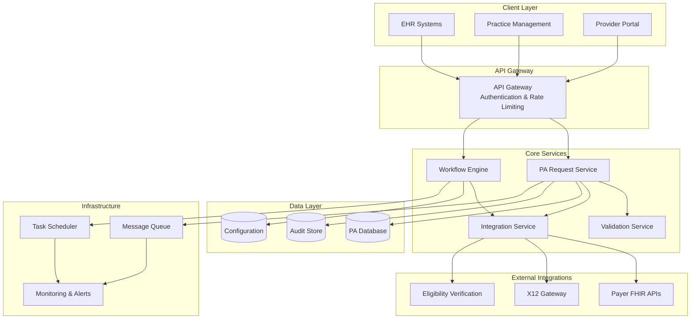

# Design Document: CMS Electronic PA Submission System

## Overview

The CMS Electronic PA Submission System is a comprehensive healthcare compliance solution that enables automated, electronic submission of Prior Authorization (PA) requests in accordance with CMS regulations. The system eliminates manual processes like faxing and portal submissions by implementing standardized electronic workflows using HL7 FHIR APIs and X12 278 transactions.

Key design principles:
- **Compliance-first**: Built to meet CMS-0057-F final rule requirements
- **Automation-focused**: Minimize manual intervention through intelligent workflows
- **Standards-based**: Leverage HL7 FHIR R4 and Da Vinci implementation guides
- **Integration-ready**: Seamless connectivity with existing healthcare systems
- **Security-by-design**: HIPAA-compliant data protection throughout

The system supports the complete PA lifecycle from request creation through decision tracking, with real-time status updates and comprehensive audit trails.

## Architecture

The system follows a microservices architecture with clear separation of concerns:



### Architectural Patterns

- **Event-Driven Architecture**: Asynchronous processing using message queues for scalability
- **Circuit Breaker Pattern**: Resilient external API integration with fallback mechanisms  
- **CQRS Pattern**: Separate read/write models for PA data and audit trails
- **Saga Pattern**: Distributed transaction management for multi-step PA workflows

## Components and Interfaces

### PA Request Service

**Responsibilities:**
- PA request lifecycle management (create, update, submit, track)
- Data validation and enrichment
- Status management and notifications
- Audit trail generation

**Key Interfaces:**
```typescript
interface PARequestService {
  createRequest(request: PARequest): Promise<PARequestId>
  submitRequest(requestId: PARequestId): Promise<SubmissionResult>
  getRequestStatus(requestId: PARequestId): Promise<PAStatus>
  updateRequest(requestId: PARequestId, updates: PAUpdate): Promise<void>
  searchRequests(criteria: SearchCriteria): Promise<PARequest[]>
}
```

### Workflow Engine

**Responsibilities:**
- Automated workflow execution based on configurable rules
- Decision routing and escalation
- Retry logic and error handling
- Integration orchestration

**Key Interfaces:**
```typescript
interface WorkflowEngine {
  executeWorkflow(workflowId: string, context: WorkflowContext): Promise<WorkflowResult>
  configureWorkflow(definition: WorkflowDefinition): Promise<void>
  pauseWorkflow(instanceId: string): Promise<void>
  resumeWorkflow(instanceId: string): Promise<void>
}
```

### Integration Service

**Responsibilities:**
- FHIR API client implementation
- X12 transaction processing
- Payer-specific protocol handling
- Response parsing and normalization

**Key Interfaces:**
```typescript
interface IntegrationService {
  submitFHIRRequest(request: FHIRBundle, endpoint: string): Promise<FHIRResponse>
  submitX12Request(transaction: X12Transaction, endpoint: string): Promise<X12Response>
  verifyEligibility(patient: Patient, coverage: Coverage): Promise<EligibilityResult>
  queryPayerCapabilities(payerId: string): Promise<PayerCapabilities>
}
```

### Validation Service

**Responsibilities:**
- CMS compliance validation
- Data completeness verification
- Business rule enforcement
- Format validation (FHIR, X12)

**Key Interfaces:**
```typescript
interface ValidationService {
  validatePARequest(request: PARequest): Promise<ValidationResult>
  validateFHIRBundle(bundle: FHIRBundle): Promise<FHIRValidationResult>
  validateX12Transaction(transaction: X12Transaction): Promise<X12ValidationResult>
  enforceBusinessRules(request: PARequest, rules: BusinessRule[]): Promise<RuleResult>
}
```

## Data Models

### Core PA Request Model

```typescript
interface PARequest {
  id: PARequestId
  status: PAStatus
  priority: Priority // URGENT | STANDARD
  
  // Patient Information
  patient: {
    id: string
    demographics: PatientDemographics
    memberId: string
    coverageInfo: Coverage[]
  }
  
  // Provider Information  
  requestingProvider: {
    npi: string
    name: string
    organization: Organization
    contactInfo: ContactInfo
  }
  
  // Clinical Information
  serviceRequest: {
    serviceType: CodeableConcept
    diagnosis: Diagnosis[]
    procedure: Procedure[]
    supportingDocumentation: DocumentReference[]
  }
  
  // Administrative
  submissionDetails: {
    submittedAt: DateTime
    submissionMethod: SubmissionMethod // FHIR | X12
    payerEndpoint: string
    trackingId: string
  }
  
  // Workflow
  workflowState: WorkflowState
  automationFlags: AutomationFlags
  
  // Audit
  auditTrail: AuditEntry[]
  createdAt: DateTime
  updatedAt: DateTime
}

enum PAStatus {
  DRAFT = "draft",
  PENDING_VALIDATION = "pending-validation", 
  VALIDATED = "validated",
  SUBMITTED = "submitted",
  IN_REVIEW = "in-review",
  APPROVED = "approved",
  DENIED = "denied",
  MORE_INFO_REQUIRED = "more-info-required",
  CANCELLED = "cancelled",
  ERROR = "error"
}

enum Priority {
  URGENT = "urgent",    // 72 hour response required
  STANDARD = "standard" // 7 day response required
}
```

### FHIR Resource Mappings

The system uses standard FHIR R4 resources following the Da Vinci PAS implementation guide:

- **Claim**: Primary resource for PA requests
- **Patient**: Patient demographics and identifiers
- **Practitioner**: Requesting provider information
- **Organization**: Healthcare organizations
- **Coverage**: Insurance coverage details
- **ServiceRequest**: Requested services/procedures
- **Condition**: Diagnosis information
- **DocumentReference**: Supporting clinical documentation

### X12 Transaction Support

For payers requiring X12 278 transactions:
- **278 Request**: Prior authorization request
- **278 Response**: Prior authorization response
- **270/271**: Eligibility verification (supporting)

## Correctness Properties

*A property is a characteristic or behavior that should hold true across all valid executions of a system—essentially, a formal statement about what the system should do. Properties serve as the bridge between human-readable specifications and machine-verifiable correctness guarantees.*

Before defining the correctness properties, I need to analyze the acceptance criteria from the requirements to determine which are testable as properties.

### Property 1: CMS-Compliant Electronic Transmission
*For any* PA request submitted through the system, the transmission format SHALL conform to CMS requirements (X12 278 or FHIR R4) and pass all CMS validation rules before transmission.
**Validates: Requirements 1.1, 4.2**

### Property 2: Unique Tracking Identifier Generation
*For any* set of PA requests processed by the system, all generated tracking identifiers SHALL be unique across the entire system.
**Validates: Requirements 1.3**

### Property 3: Comprehensive Retry Behavior
*For any* failed electronic submission, the system SHALL implement exponential backoff retry logic according to configured policies, with retry attempts matching the specified parameters.
**Validates: Requirements 1.4, 8.2**

### Property 4: Multi-Payer Electronic Routing
*For any* PA request with valid payer information, the system SHALL successfully route the request to the appropriate payer endpoint using standardized electronic interfaces.
**Validates: Requirements 1.5**

### Property 5: Comprehensive Automation
*For any* PA request creation, the system SHALL automatically populate available fields from existing patient/provider data, attach required documentation when available, and retrieve patient data from connected systems without manual intervention.
**Validates: Requirements 2.1, 2.2, 6.2**

### Property 6: Rule-Based Auto-Submission
*For any* PA request that meets predefined auto-submission criteria, the system SHALL automatically submit the request without manual review, while requests not meeting criteria SHALL require manual review.
**Validates: Requirements 2.3**

### Property 7: Real-Time Status Management
*For any* PA request status change or response received, the system SHALL immediately update the request status and notify all relevant parties in real-time.
**Validates: Requirements 2.4, 7.1**

### Property 8: Consistent Workflow Execution
*For any* configured workflow rules, the system SHALL execute them consistently, producing identical outcomes for equivalent PA requests.
**Validates: Requirements 2.5**

### Property 9: Electronic-Only Enforcement
*For any* attempt to use legacy submission methods (fax, manual portal), the system SHALL redirect to electronic workflows and maintain zero tolerance for non-electronic submissions in compliant workflows.
**Validates: Requirements 3.2, 3.4**

### Property 10: Resilient Queuing
*For any* PA request when electronic submission is unavailable, the system SHALL queue the request for automatic retry rather than requiring manual intervention or reverting to manual methods.
**Validates: Requirements 3.3, 8.3**

### Property 11: Automated Portal Integration
*For any* payer requiring portal-based submission, the system SHALL automate the portal interaction programmatically rather than requiring manual portal access.
**Validates: Requirements 3.5**

### Property 12: Comprehensive Security Compliance
*For any* PA data transmission or storage, the system SHALL encrypt communications using TLS 1.3+, authenticate all access attempts, and encrypt sensitive data at rest using AES-256.
**Validates: Requirements 5.1, 5.2, 5.3**

### Property 13: Complete Audit Trail
*For any* PA-related activity or data access, the system SHALL generate detailed audit entries that capture all relevant information for compliance and security monitoring.
**Validates: Requirements 5.4**

### Property 14: Security Incident Response
*For any* detected security incident, the system SHALL immediately alert administrators and log the event with complete details.
**Validates: Requirements 5.5**

### Property 15: Conditional Eligibility Verification
*For any* PA request where the target payer system supports real-time eligibility verification, the system SHALL perform eligibility verification before submission.
**Validates: Requirements 6.4**

### Property 16: Compliance Reporting
*For any* generated compliance report, the report SHALL include all required CMS compliance metrics, electronic submission statistics, and regulatory reporting data.
**Validates: Requirements 4.5, 7.3**

### Property 17: Alert-Based Notifications
*For any* configured alert condition (overdue responses, compliance issues), the system SHALL notify relevant users when the condition is detected.
**Validates: Requirements 7.5**

### Property 18: Comprehensive Error Handling
*For any* electronic submission failure, the system SHALL log detailed error information, maintain request integrity, ensure no data loss, and attempt automatic recovery.
**Validates: Requirements 8.1, 8.4**

### Property 19: Automatic Recovery Processing
*For any* system recovery completion, the system SHALL automatically resume processing all queued PA requests without manual intervention.
**Validates: Requirements 8.5**

## Error Handling

The system implements comprehensive error handling across all components:

### Error Categories

1. **Validation Errors**: Data completeness, format compliance, business rule violations
2. **Integration Errors**: Network failures, payer system unavailability, authentication failures  
3. **System Errors**: Database connectivity, service unavailability, resource exhaustion
4. **Security Errors**: Authentication failures, authorization violations, encryption errors

### Error Handling Strategies

**Validation Errors**:
- Immediate feedback to users with specific error details
- Prevent submission until all validation issues resolved
- Maintain draft state for partial corrections

**Integration Errors**:
- Exponential backoff retry with configurable limits
- Circuit breaker pattern for failing external services
- Graceful degradation with queuing for later retry

**System Errors**:
- Automatic failover to backup systems where available
- Request queuing during temporary outages
- Administrative alerts for persistent issues

**Security Errors**:
- Immediate session termination for authentication failures
- Detailed security event logging
- Automatic incident response workflows

### Recovery Mechanisms

- **Transactional Integrity**: All PA operations wrapped in database transactions
- **Idempotent Operations**: Safe retry of failed operations without side effects
- **State Reconciliation**: Automatic detection and correction of inconsistent states
- **Data Backup**: Continuous backup with point-in-time recovery capabilities

## Testing Strategy

The testing strategy employs a dual approach combining unit testing for specific scenarios with property-based testing for comprehensive validation of system behaviors.

### Property-Based Testing

Property-based tests validate universal correctness properties across randomly generated inputs. Each property test will run a minimum of 100 iterations to ensure comprehensive coverage.

**Configuration**:
- **Testing Framework**: Hypothesis (Python) or fast-check (TypeScript/JavaScript)
- **Iterations**: Minimum 100 per property test
- **Test Tagging**: Each test tagged with format: **Feature: cms-electronic-pa-submission, Property {number}: {property_text}**

**Property Test Coverage**:
- All 19 correctness properties will be implemented as property-based tests
- Random generation of PA requests, patient data, and system configurations
- Validation of invariants across all possible input combinations
- Testing of error conditions and edge cases through generated scenarios

### Unit Testing

Unit tests focus on specific examples, integration points, and edge cases that complement property-based testing:

**Core Areas**:
- **Format Validation**: Specific X12 278 and FHIR validation scenarios
- **Integration Points**: EHR, payer API, and external system connections
- **Security Functions**: Encryption, authentication, and audit trail generation
- **Error Scenarios**: Specific failure modes and recovery procedures
- **Configuration Management**: Workflow rules and system configuration handling

**Testing Balance**:
- Property tests handle comprehensive input coverage and universal behaviors
- Unit tests focus on specific examples, edge cases, and integration scenarios
- Both approaches are complementary and necessary for complete system validation

### Integration Testing

- **End-to-End Workflows**: Complete PA submission flows from creation to decision
- **External System Integration**: Real connections to test payer APIs and EHR systems
- **Security Testing**: Penetration testing and vulnerability assessments
- **Performance Testing**: Load testing for high-volume PA processing scenarios

### Compliance Testing

- **CMS Regulation Compliance**: Validation against CMS-0057-F requirements
- **Standards Conformance**: X12 278 and FHIR R4 specification compliance
- **HIPAA Compliance**: Security and privacy requirement validation
- **Audit Trail Verification**: Complete audit trail accuracy and completeness