# CMS Electronic PA Submission System - Architecture

## System Overview

The CMS Electronic PA Submission System is a microservices-based healthcare compliance solution that automates Prior Authorization (PA) request submission in accordance with CMS regulations.

## High-Level Architecture

```mermaid
graph TB
    subgraph "Client Layer"
        EHR[EHR Systems<br/>HL7 FHIR APIs]
        PMS[Practice Management<br/>Systems]
        Portal[Provider Portal<br/>Web Interface]
    end
    
    subgraph "API Gateway Layer"
        Gateway[API Gateway<br/>✅ IMPLEMENTED<br/>- JWT Authentication<br/>- Rate Limiting<br/>- CORS & Security Headers<br/>- Request Logging]
    end
    
    subgraph "Core Services Layer"
        PAService[PA Request Service<br/>🔄 PLANNED<br/>- CRUD Operations<br/>- Status Management<br/>- Lifecycle Tracking]
        
        WorkflowEngine[Workflow Engine<br/>🔄 PLANNED<br/>- Rule Execution<br/>- Auto-Submission<br/>- Decision Routing]
        
        ValidationService[Validation Service<br/>🔄 PLANNED<br/>- CMS Compliance<br/>- FHIR Validation<br/>- X12 Validation]
        
        IntegrationService[Integration Service<br/>🔄 PLANNED<br/>- FHIR Client<br/>- X12 Gateway<br/>- Payer APIs]
        
        SecurityService[Security Service<br/>🔄 PLANNED<br/>- Encryption<br/>- TLS Management<br/>- Incident Detection]
        
        AuditService[Audit Trail Service<br/>🔄 PLANNED<br/>- Event Logging<br/>- Compliance Tracking]
    end
    
    subgraph "External Integration Layer"
        PayerFHIR[Payer FHIR APIs<br/>Da Vinci PAS]
        X12Gateway[X12 278 Gateway<br/>EDI Processing]
        EligibilityAPI[Eligibility<br/>Verification APIs]
    end
    
    subgraph "Data Layer"
        PostgreSQL[(PostgreSQL<br/>✅ IMPLEMENTED<br/>- pa_requests<br/>- audit_trail<br/>- system_configuration<br/>- workflow_rules<br/>- payer_endpoints<br/>- retry_queue)]
        
        Redis[(Redis<br/>✅ CONFIGURED<br/>- Session Cache<br/>- Rate Limiting<br/>- Temp Storage)]
    end
    
    subgraph "Infrastructure Layer"
        RabbitMQ[RabbitMQ<br/>✅ IMPLEMENTED<br/>- Event Queues<br/>- Async Processing<br/>- Message Routing]
        
        Logger[Winston Logger<br/>✅ IMPLEMENTED<br/>- Structured Logging<br/>- File Rotation<br/>- Error Tracking]
        
        Monitoring[Monitoring & Alerts<br/>🔄 PLANNED<br/>- Health Checks<br/>- Metrics<br/>- Alerting]
    end
    
    %% Client to Gateway
    EHR --> Gateway
    PMS --> Gateway
    Portal --> Gateway
    
    %% Gateway to Services
    Gateway --> PAService
    Gateway --> WorkflowEngine
    Gateway --> ValidationService
    
    %% Service Interactions
    PAService --> ValidationService
    PAService --> IntegrationService
    PAService --> AuditService
    WorkflowEngine --> IntegrationService
    WorkflowEngine --> PAService
    ValidationService --> AuditService
    
    %% External Integrations
    IntegrationService --> PayerFHIR
    IntegrationService --> X12Gateway
    IntegrationService --> EligibilityAPI
    
    %% Data Layer Connections
    PAService --> PostgreSQL
    WorkflowEngine --> PostgreSQL
    ValidationService --> PostgreSQL
    AuditService --> PostgreSQL
    SecurityService --> PostgreSQL
    
    PAService --> Redis
    Gateway --> Redis
    
    %% Infrastructure Connections
    PAService --> RabbitMQ
    WorkflowEngine --> RabbitMQ
    IntegrationService --> RabbitMQ
    
    PAService --> Logger
    Gateway --> Logger
    WorkflowEngine --> Logger
    
    RabbitMQ --> Monitoring
    PostgreSQL --> Monitoring
    
    style Gateway fill:#90EE90
    style PostgreSQL fill:#90EE90
    style RabbitMQ fill:#90EE90
    style Logger fill:#90EE90
    style Redis fill:#FFE4B5
    style PAService fill:#FFE4B5
    style WorkflowEngine fill:#FFE4B5
    style ValidationService fill:#FFE4B5
    style IntegrationService fill:#FFE4B5
    style SecurityService fill:#FFE4B5
    style AuditService fill:#FFE4B5
    style Monitoring fill:#FFE4B5
```

**Legend:**
- 🟢 Green: ✅ Implemented
- 🟡 Yellow: 🔄 Planned/In Progress

## Component Architecture

```mermaid
graph LR
    subgraph "API Gateway ✅"
        Auth[Authentication<br/>Middleware]
        RateLimit[Rate Limiting<br/>Middleware]
        ErrorHandler[Error Handler<br/>Middleware]
        RequestLog[Request Logger<br/>Middleware]
        Routes[Route Handlers]
    end
    
    subgraph "PA Request Service 🔄"
        CRUD[CRUD Operations]
        StatusMgmt[Status Management]
        Enrichment[Data Enrichment]
        Notification[Notifications]
    end
    
    subgraph "Workflow Engine 🔄"
        RuleEngine[Rule Engine]
        AutoSubmit[Auto-Submission]
        Routing[Decision Routing]
        Retry[Retry Logic]
    end
    
    subgraph "Integration Service 🔄"
        FHIRClient[FHIR Client]
        X12Processor[X12 Processor]
        PayerRouter[Payer Router]
        EligCheck[Eligibility Check]
    end
    
    subgraph "Validation Service 🔄"
        CMSRules[CMS Rules]
        FHIRVal[FHIR Validator]
        X12Val[X12 Validator]
        BusinessRules[Business Rules]
    end
    
    Auth --> Routes
    RateLimit --> Auth
    ErrorHandler --> Routes
    RequestLog --> RateLimit
    
    Routes --> CRUD
    CRUD --> StatusMgmt
    StatusMgmt --> Enrichment
    Enrichment --> Notification
    
    CRUD --> RuleEngine
    RuleEngine --> AutoSubmit
    AutoSubmit --> Routing
    Routing --> Retry
    
    AutoSubmit --> FHIRClient
    AutoSubmit --> X12Processor
    FHIRClient --> PayerRouter
    X12Processor --> PayerRouter
    PayerRouter --> EligCheck
    
    CRUD --> CMSRules
    CMSRules --> FHIRVal
    CMSRules --> X12Val
    FHIRVal --> BusinessRules
```

## Data Flow Architecture

```mermaid
sequenceDiagram
    participant EHR as EHR System
    participant Gateway as API Gateway ✅
    participant PAService as PA Service 🔄
    participant Validation as Validation Service 🔄
    participant Workflow as Workflow Engine 🔄
    participant Integration as Integration Service 🔄
    participant Payer as Payer API
    participant DB as PostgreSQL ✅
    participant Queue as RabbitMQ ✅
    participant Audit as Audit Service 🔄
    
    EHR->>Gateway: POST /api/v1/pa-requests
    Gateway->>Gateway: Authenticate JWT
    Gateway->>Gateway: Rate Limit Check
    Gateway->>PAService: Create PA Request
    
    PAService->>DB: Generate Tracking ID
    PAService->>Validation: Validate Request
    Validation->>Validation: Check CMS Rules
    Validation->>Validation: Validate FHIR/X12
    Validation-->>PAService: Validation Result
    
    PAService->>DB: Save PA Request (DRAFT)
    PAService->>Queue: Publish pa.request.created
    PAService->>Audit: Log Creation Event
    PAService-->>Gateway: Return PA Request
    Gateway-->>EHR: 201 Created
    
    Queue->>Workflow: Consume pa.request.created
    Workflow->>Workflow: Evaluate Auto-Submit Rules
    
    alt Auto-Submit Criteria Met
        Workflow->>PAService: Update Status (VALIDATED)
        PAService->>DB: Update Status
        PAService->>Queue: Publish pa.request.validated
        
        Workflow->>Integration: Submit to Payer
        Integration->>Integration: Select Protocol (FHIR/X12)
        Integration->>Integration: Route to Payer Endpoint
        Integration->>Payer: Submit PA Request
        Payer-->>Integration: Submission Response
        
        Integration->>PAService: Update Submission Details
        PAService->>DB: Update Status (SUBMITTED)
        PAService->>Queue: Publish pa.request.submitted
        PAService->>Audit: Log Submission Event
        
    else Manual Review Required
        Workflow->>PAService: Route to Manual Review
        PAService->>Queue: Publish pa.notification.required
    end
```

## Database Schema

## Event-Driven Architecture

## Security Architecture

```mermaid
graph TB
    subgraph "External Clients"
        Client[Client Application]
    end
    
    subgraph "Security Layers"
        TLS[TLS 1.3+ Encryption<br/>🔄 PLANNED]
        JWT[JWT Authentication<br/>✅ IMPLEMENTED]
        RBAC[Role-Based Access Control<br/>✅ IMPLEMENTED]
        RateLimit[Rate Limiting<br/>✅ IMPLEMENTED]
        Encryption[AES-256 Encryption<br/>🔄 PLANNED]
    end
    
    subgraph "Application Layer"
        API[API Gateway]
        Services[Core Services]
    end
    
    subgraph "Data Layer"
        DBEncrypted[Encrypted Database<br/>🔄 PLANNED]
        AuditLog[Audit Trail<br/>✅ IMPLEMENTED]
    end
    
    subgraph "Monitoring"
        SecurityMonitor[Security Monitoring<br/>🔄 PLANNED]
        IncidentResponse[Incident Response<br/>🔄 PLANNED]
    end
    
    Client --> TLS
    TLS --> JWT
    JWT --> RBAC
    RBAC --> RateLimit
    RateLimit --> API
    
    API --> Services
    Services --> Encryption
    Encryption --> DBEncrypted
    
    Services --> AuditLog
    AuditLog --> SecurityMonitor
    SecurityMonitor --> IncidentResponse
```

## Deployment Architecture

## Technology Stack

### Backend
- **Runtime**: Node.js 18+
- **Language**: TypeScript 5.3+
- **Framework**: Express.js 4.18+
- **Testing**: Jest 29+ with fast-check for property-based testing

### Data Storage
- **Primary Database**: PostgreSQL 14+
- **Cache**: Redis 7+
- **Message Queue**: RabbitMQ 3.11+

### Security
- **Authentication**: JWT (jsonwebtoken)
- **Encryption**: bcrypt, AES-256
- **TLS**: TLS 1.3+
- **Security Headers**: Helmet.js

### Integration
- **FHIR**: HL7 FHIR R4 (planned)
- **X12**: X12 278 transactions (planned)
- **Standards**: Da Vinci PAS implementation guide

### Infrastructure
- **Logging**: Winston
- **Monitoring**: Prometheus + Grafana (planned)
- **Containerization**: Docker + Docker Compose
- **Orchestration**: Kubernetes (planned for production)

## Implementation Status

### ✅ Completed (Tasks 1-2.2)
- Project structure and configuration
- Database schemas and migrations
- Message queue infrastructure
- API Gateway with authentication
- Rate limiting and security headers
- Logging infrastructure
- Data models and TypeScript interfaces
- Tracking ID generation with property tests

### 🔄 In Progress / Planned
- Validation Service (Task 2.3-2.4)
- PA Request Service (Task 3.1-3.5)
- Workflow Engine (Task 5.1-5.4)
- Integration Service (Task 6.1-6.6)
- Security Service (Task 7.1-7.6)
- Error Handling (Task 9.1-9.7)
- Reporting & Compliance (Task 11.1-11.4)
- EHR Integration APIs (Task 12.1-12.3)
- End-to-End Integration (Task 13.1-13.3)

## Scalability Considerations

### Horizontal Scaling
- Stateless API Gateway instances
- Service instances can be scaled independently
- Load balancing across multiple instances

### Database Scaling
- Read replicas for query distribution
- Connection pooling (20 connections per instance)
- Indexed queries for performance

### Message Queue Scaling
- RabbitMQ clustering for high availability
- Queue partitioning for load distribution
- Consumer scaling based on queue depth

### Caching Strategy
- Redis for session management
- Rate limiting counters
- Temporary data storage
- Cache invalidation on updates

## High Availability

### Database
- Primary-replica replication
- Automatic failover
- Point-in-time recovery
- Daily backups with 30-day retention

### Message Queue
- RabbitMQ cluster with mirrored queues
- Durable queues and persistent messages
- Automatic reconnection on failure

### Application
- Multiple API Gateway instances
- Health checks and readiness probes
- Graceful shutdown handling
- Circuit breaker pattern for external services

## Monitoring & Observability

### Metrics
- Request rate and latency
- Error rates by endpoint
- Database connection pool usage
- Message queue depth
- Cache hit/miss rates

### Logging
- Structured JSON logging
- Log levels: error, warn, info, debug
- Request/response logging
- Audit trail logging
- Log aggregation and search

### Alerting
- High error rates
- Slow response times
- Database connection issues
- Message queue backlog
- Security incidents

## Compliance & Standards

### CMS Compliance
- CMS-0057-F final rule requirements
- Electronic submission standards
- Response time requirements (72hr urgent, 7 day standard)

### Healthcare Standards
- HL7 FHIR R4
- X12 278 transactions
- Da Vinci PAS implementation guide
- HIPAA security and privacy

### Security Standards
- TLS 1.3+ encryption
- AES-256 data encryption
- JWT authentication
- Comprehensive audit trails
- Security incident response

---

**Document Version**: 1.0
**Last Updated**: January 2024
**Status**: Foundation Complete, Business Logic In Progress
